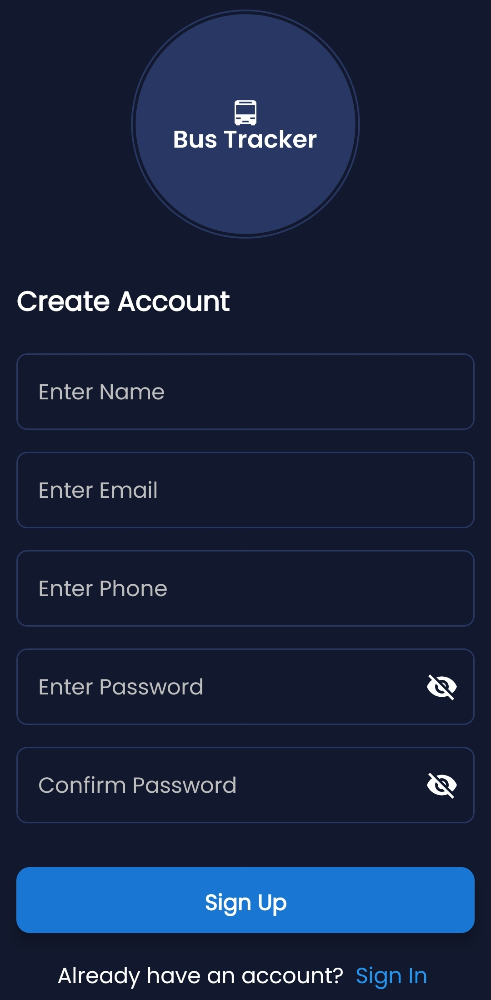
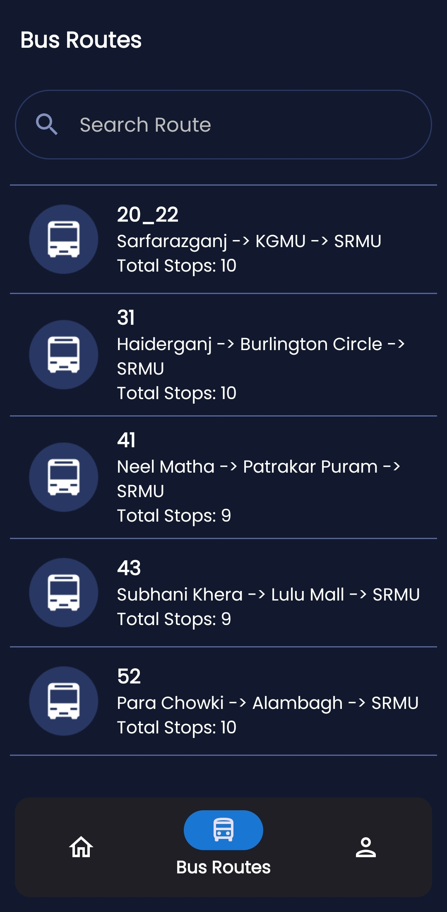
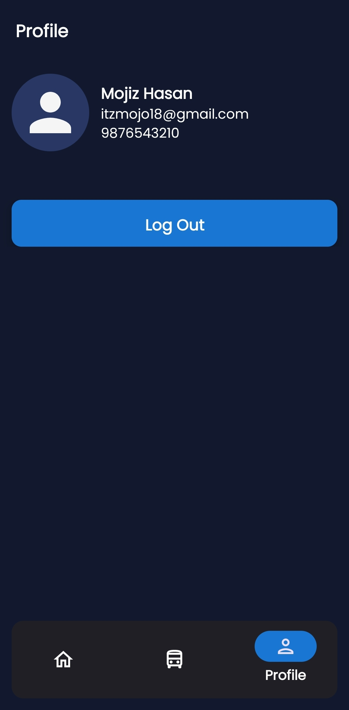

# 🚍 University Bus Tracking & Issue Reporting System

An Android application built using **Kotlin**, **Jetpack Compose**, and **Firebase** that enables students, faculty, and staff to **track university buses in real time**, view detailed route information, and report bus-related issues such as overcrowding, delays, or maintenance problems.  

The system leverages **Google Maps API** for live tracking, **Firebase Firestore** for real-time database operations, and **Firebase Authentication** for secure user management.

---

## 🧭 Features

### 🎯 Core Functionality
- **Real-time Bus Tracking:** View live bus locations on an interactive Google Map.
- **Bus Route Visualization:** Display all stops and routes of each university bus.
- **User Authentication:** Sign-up and sign-in using Firebase Authentication.
- **Profile Management:** View and manage user details within the app.

### 🧾 Issue Reporting Portal
- Submit issues related to university buses (e.g., overcrowding, damage, delay).
- Track issue status in real-time — *Open*, *Resolved*, or *Dismissed*.
- Receive notifications when issues are resolved by the admin.

### 🗺️ Google Maps Integration
- Displays user and bus locations using **Maps Compose**.
- Real-time marker updates for moving buses.
- Route visualization connecting all stops with polylines.

---

## 🛠️ Tech Stack

| Layer | Technology |
|-------|-------------|
| **Frontend (App)** | Kotlin, Jetpack Compose |
| **Backend** | Firebase (Firestore, Auth, Cloud Messaging) |
| **Maps Integration** | Google Maps SDK & Maps Compose Library |
| **Architecture** | MVVM (Model–View–ViewModel) |
| **Dependency Injection** | Hilt |
| **Asynchronous Operations** | Kotlin Coroutines, Flow |
| **UI Components** | Material 3, Compose Navigation |

---

## 📱 App Structure

com.example.campuswheels/  
│  
├── core/ # Common utilities & navigation  
├── feature_auth/ # Authentication module  
├── feature_bus/ # Bus tracking module  
├── feature_bus_routes/ # Route details and visualization  
├── feature_profile/ # User profile management  
├── feature_issues/ # Issue reporting system  
└── ui/theme/ # App theme & styles  

---

## 🚀 Future Scope

- 🗣️ **AI-based Route Optimization** for better timing prediction.  
- 🔔 **Advanced Notification System** with push alerts for bus arrival and delays.  
- 🧭 **Offline Support** using local caching.  
- 🪄 **Admin Dashboard** for monitoring and resolving user issues.  
- 📸 **Image Uploads** for reporting physical bus damages.  

---

## 📸 Screenshots

| Sign Up | Login | Home Screen |
|------------|------------|----------------|
|  |  |  |

| Bus Routes | Route Details | Profile Screen |
|--------------|------------------|----------------|
|  |  |  |

---

## 👨‍💻 Author

**Mojiz Hasan**  
📧 mojiz.hasan.786@gmail.com  
🔗 [LinkedIn Profile Link](https://www.linkedin.com/in/mohd-mojiz-hasan-a28b382b9/)  
💻 [GitHub Profile Link](https://github.com/SyedRizvi786092/)

---

## 🧾 License

This project is developed for **academic and demonstration purposes**.  
All rights reserved © 2025 Mohd Mojiz Hasan.

---
